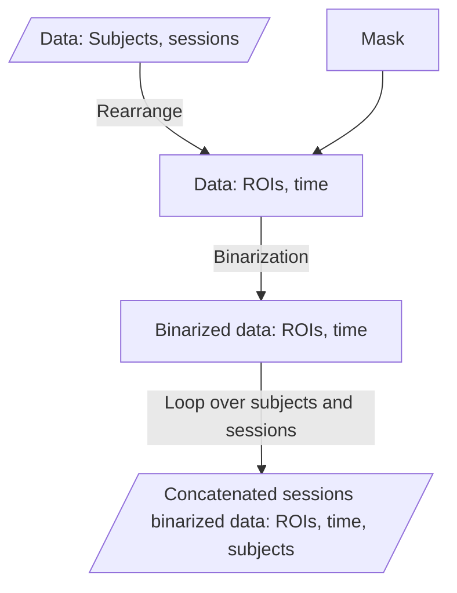
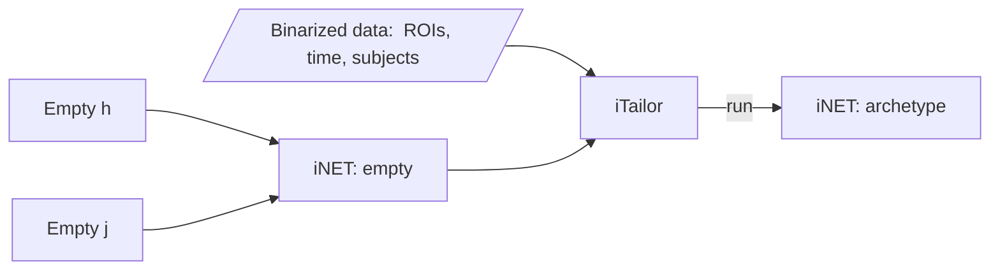
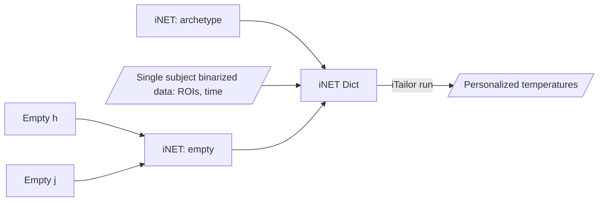

# LSD-paper-code-Ruffini-et-al.-2022
Contact: G. Ruffini (giulio.ruffini@neuroelectrics.com) [Nov 2022]

Ref: 
[https://www.biorxiv.org/content/10.1101/2022.08.27.505518v4](https://www.biorxiv.org/content/10.1101/2022.08.27.505518v4)

To be able to run the Jupyter notebook you will need data access. The Jupyter notebook expects a data folder with lsd and supp_data subfolders:
```
data/
   lsd/
      - LSD_all.npy
      - LSD_all.mat
   supp_data/     
      -  AAL.pkl
```
See https://zenodo.org/record/7476255#.Y6WJAC-B3T9 for requesting data access.

## SMITH library
The Neuroelectrics ```SMITH``` library is used to build Ising models from BOLD data or filtered amplitude envelope of EEG data.


## Structure of the library
The software tool is based on the following libraries:

 * **`inet`:** iNeT object defined by the Ising parameters and a parameter beta, related to temperature. It also contains the implementation of the metropolis algorithm to obtain relevant thermodynamic variables.
 * **`itailor`:** Class to create archetypes and personalised Ising models from data and an iNeT object
 * **`istimweaver`:** Class to get suggestions for the stimweaver pipeline from the results of the Ising model simulations
 * **`utilities`:** Includes the binarization tool to transform BOLD or EEG 
   data into its corresponding binarised pattern. It includes as well some 
   information theory based metrics and tools.

 
#### Data preprocessing for iTailor
Data needs to be binarized.The binarize function in utilities allows to perform this using different thresholding methods (median, mean or std).

 > In this schematics and the following ones, squares refer to intermediate variables/structures rather than processes themselves as in standard flowcharts.
 
#### Archetype creation
To create an archetype, the iTailor run method runs the Ezaki method to estimate h and j. What it does is to estimate h and j of the best Ising model that describes the data of all the subjects. It needs an empty-initialized iNET. It is also compatible with another method named `personalized_H`.

#### iNET Personalization
To personalize an iNET given an archetype, we want the temperatures for which the archetype best describes the data of a given subject. This process can be run for each subjects whose temperature needs to be computed. 

 

